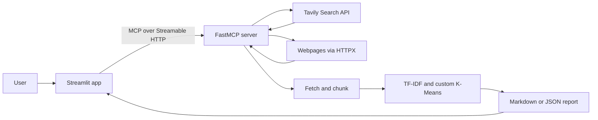

# ResearchMate AI — MCP-Powered Deep Research Assistant

ResearchMate AI searches the web with Tavily, fetches and chunks webpages, groups text with custom TF-IDF/K-Means code, and produces Markdown or JSON reports. A Streamlit UI runs the workflow through four FastMCP tools.

> Clustering is lexical, not LLM-based. This project does not use embeddings, RAG, a vector database, or autonomous planning. Review sources before relying on report content.

## Features

- Tavily web search and ranked results.
- Asynchronous webpage fetching and HTML text cleanup.
- Configurable word-based chunks with overlap.
- TF-IDF features, custom Python K-Means, and keyword-based labels.
- Structured reports with excerpts and source URLs.
- Streamlit settings for result count, cluster count, URL count, report format, and server URL; downloadable reports.

## Architecture and workflow



**Search → Fetch → Chunk → Cluster → Report**. The UI makes three fixed search queries, deduplicates and ranks results, fetches the selected URLs, clusters their text, then assembles a report. TF-IDF represents word usage; it does not infer meaning like language-model embeddings. Report summaries are template-based and extractive.

## Technology

| Technology | Purpose |
|---|---|
| Python, `asyncio` | Application logic and asynchronous operations |
| FastMCP | MCP server, tools, and client |
| Streamlit | User interface and report downloads |
| Tavily Search API | Web search |
| HTTPX | Asynchronous API and webpage requests |
| TF-IDF, custom K-Means | Lexical text representation and clustering |
| `python-dotenv` | Load `.env` settings |

**Dependency note:** `requirements.txt` declares `fastmcp>=0.1.0`, not a specific 3.x version. It also lists packages not imported by the current code, including `tavily-python`, NumPy, scikit-learn, sentence-transformers, Beautiful Soup, and lxml. Tavily is called directly through HTTPX, and clustering/text extraction use custom Python code and regular expressions.

## MCP tools

| Tool | Function |
|---|---|
| `search_web()` | Search Tavily; returns ranked results and metadata. |
| `fetch_and_chunk()` | Fetch up to 10 URLs concurrently and split extracted text into overlapping chunks. |
| `cluster_findings()` | Cluster text chunks with TF-IDF and custom K-Means; infer labels from keywords. |
| `generate_report()` | Assemble Markdown or JSON with summaries and source URLs. |

Defaults include 8 search results, 400 words per chunk, 50-word overlap, 6 chunks per URL, and 4 clusters. The UI exposes its own controls for result count, cluster count, URLs, report format, and server URL.

## Project structure

```text
ResearchMate AI/
├── app.py            # Streamlit UI and workflow
├── server.py         # FastMCP tools and research logic
├── requirements.txt  # Python dependencies
├── .gitignore        # Ignores local secrets and environments
├── .env              # Create locally; ignored by Git
└── README.md
```

## Install (Windows / PowerShell)

Use Python 3.11 or another version compatible with the declared dependencies. From the project directory:

```powershell
py -3.11 -m venv .venv
Set-ExecutionPolicy -Scope Process -ExecutionPolicy RemoteSigned
.\.venv\Scripts\Activate.ps1
python -m pip install --upgrade pip
python -m pip install -r requirements.txt
```

Create `.env` in the project root:

```env
TAVILY_API_KEY=tvly-your-key-here
MCP_HOST=localhost
MCP_PORT=8000
TAVILY_SEARCH_DEPTH=advanced
```

Get a key at [Tavily](https://app.tavily.com/). Never commit or share it. There is no checked-in `.env.example`.

## Run

Open two PowerShell terminals in the project folder and activate `.venv` in each.

**Terminal 1 — MCP server:**

```powershell
python server.py
```

**Terminal 2 — Streamlit UI:**

```powershell
streamlit run app.py
```

Open the URL printed by Streamlit, usually [http://localhost:8501](http://localhost:8501). The UI defaults to `http://localhost:8000/mcp`; change **Server URL** in the sidebar if the server uses another host or port. Use **Ping Server** to check the connection.

## Configuration

| Variable | Default | Purpose |
|---|---|---|
| `TAVILY_API_KEY` | Required | Tavily authentication |
| `MCP_HOST` | `localhost` | Server bind host |
| `MCP_PORT` | `8000` | Server port |
| `TAVILY_SEARCH_DEPTH` | `advanced` | Tavily search depth, such as `basic` or `advanced` |

The Streamlit default MCP URL is set in `app.py`; it does not automatically follow changes to `MCP_HOST` or `MCP_PORT`.

## Example queries

- `How are data centers reducing water use for cooling?`
- `Recent evidence on heat pumps and residential energy savings`
- `Battery recycling technologies and commercial constraints`

## Troubleshooting

- **Missing API key:** confirm `.env` is beside `server.py`, check `TAVILY_API_KEY`, then restart the server.
- **Port conflict:** change `MCP_PORT` and update the UI's **Server URL**.
- **Install failure:** activate `.venv`, upgrade pip, and check whether every package in `requirements.txt` supports your Python version.
- **MCP connection error:** start the server first, check the URL ends in `/mcp`, and use **Ping Server**. Check firewall settings if needed.

## Limitations and future work

TF-IDF may miss paraphrases; regex extraction may retain boilerplate or miss content. Search variations are fixed, and report summaries are not LLM-written or fact-checked. The UI download metadata is Markdown-oriented even when JSON is selected. Possible improvements include tests, leaner pinned dependencies, better extraction, configurable query/chunking behavior, and correct JSON download metadata.
